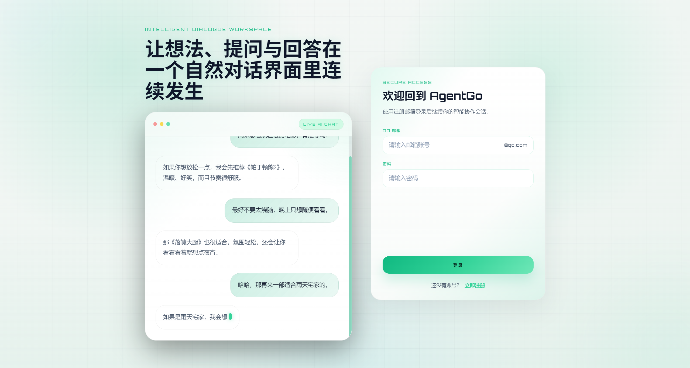
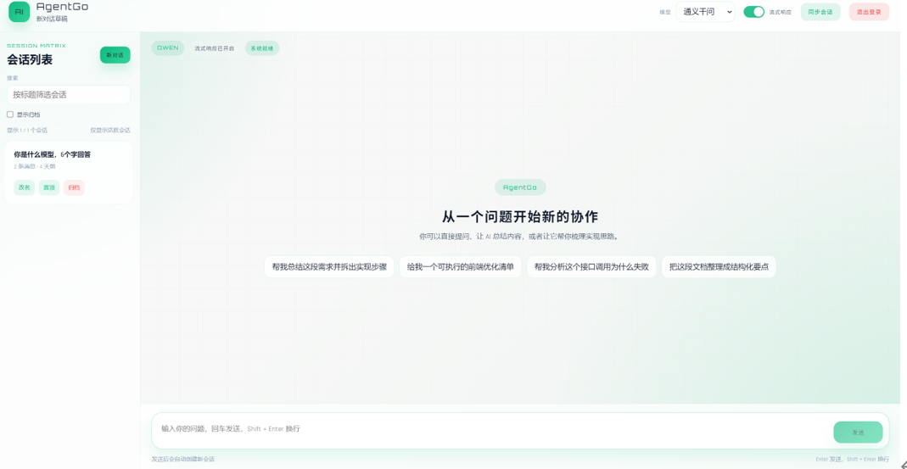

# ChatAI / AgentGo

<p>
  <a href="https://github.com"></a>
  <a href="https://golang.org"></a>
  <a href="https://vuejs.org"></a>
</p>

## 友情提示

> 1. **快速体验项目**：启动后访问 `http://localhost:8080`。
> 2. **后端服务**：默认运行在 `http://localhost:9090`。
> 3. **默认管理员**：用户名 `admin`，密码 `admin`。

## 前言

`ChatAI` 项目致力于打造一个完整的智能对话系统，采用现阶段主流技术实现，包含用户注册登录、邮件验证码、会话管理、多模型聊天、流式响应和管理员监控面板。

## 项目介绍

`ChatAI` 项目是一套智能对话系统，包括前台聊天系统及后台管理系统，基于 Go + Vue 3 实现。前台聊天系统包含登录注册、会话管理、多模型聊天、流式响应等模块。后台管理系统包含监控面板，查看请求量、错误率、平均延迟、接口与模型健康状态等功能。

### 项目演示

前端界面演示



对话界面演示




#### 前端聊天系统

前端项目地址：`client/` 目录

项目演示地址：启动后访问 `http://localhost:8080`

#### 后台管理系统

管理员监控面板地址：`http://localhost:8080/admin-metrics`

### 组织结构

```
ChatAI
├── client/                # Vue 3 前端
│   ├── public/
│   ├── src/
│   │   ├── components/
│   │   ├── composables/
│   │   ├── router/
│   │   ├── styles/
│   │   ├── utils/
│   │   └── views/
│   ├── package.json
│   └── vue.config.js
├── server/                # Go 后端
│   ├── cmd/
│   ├── config/
│   ├── infra/
│   │   ├── cache/
│   │   ├── config/
│   │   ├── db/
│   │   ├── mail/
│   │   ├── metrics/
│   │   └── mq/
│   ├── internal/
│   │   ├── admin/
│   │   ├── ai/
│   │   ├── chat/
│   │   ├── middleware/
│   │   ├── router/
│   │   ├── session/
│   │   └── user/
│   ├── pkg/
│   │   ├── code/
│   │   ├── jwt/
│   │   ├── password/
│   │   ├── response/
│   │   └── utils/
│   ├── go.mod
│   └── main.go
```

### 技术选型

#### 后端技术

| 技术       | 说明                | 官网                                   |
| ---------- | ------------------- | -------------------------------------- |
| Go         | 编程语言            | https://golang.org                     |
| Gin        | Web框架             | https://gin-gonic.com                  |
| Gorm       | ORM框架             | https://gorm.io                        |
| MySQL      | 关系型数据库        | https://www.mysql.com                  |
| Redis      | 内存数据存储        | https://redis.io/                      |
| RabbitMQ   | 消息队列            | https://www.rabbitmq.com/              |
| JWT        | JWT登录支持         | https://github.com/golang-jwt/jwt      |

#### 前端技术

| 技术       | 说明                  | 官网                                   |
| ---------- | --------------------- | -------------------------------------- |
| Vue        | 前端框架              | https://vuejs.org/                     |
| Vue-router | 路由框架              | https://router.vuejs.org/              |
| Axios      | 前端HTTP框架          | https://github.com/axios/axios         |

## 环境要求

- Go `1.24+`
- Node.js `18+`
- npm `9+`
- MySQL `8+`
- Redis `6+`
- RabbitMQ `3+`（推荐，可缺省启动为降级模式）

## 快速开始

### 1. 准备后端配置

```powershell
cd F:\ChatAI\server
Copy-Item .\config\config.example.toml .\config\config.toml
```

修改 `F:\ChatAI\server\config\config.toml` 配置文件。

### 2. 启动后端

```powershell
cd F:\ChatAI\server
go mod download
go run .
```

后端默认监听：`http://localhost:9090`

### 3. 启动前端

```powershell
cd F:\ChatAI\client
npm install
npm run serve
```

前端默认访问地址：`http://localhost:8080`

## 功能特性

- 登录 / 注册同页展示，注册与登录在同一张卡片内切换
- 邮箱验证码注册，验证码存入 Redis，并通过邮件发送
- 用户登录后签发 JWT
- 首次启动时自动检查并创建管理员账号
- AI 对话支持 `qwen` 与 `deepseek` 两种模型
- 支持普通对话与流式对话（SSE）
- 支持会话创建、会话历史、会话重命名、置顶、归档、搜索
- 支持管理员监控页，查看请求量、错误率、平均延迟、接口与模型健康状态
- 支持请求指标采集与模型调用指标采集

## API 概览

### 用户模块

- `POST /api/v1/user/captcha`：发送邮箱验证码
- `POST /api/v1/user/register`：注册
- `POST /api/v1/user/login`：登录

### 对话与会话模块

- `GET /api/v1/AI/chat/sessions`：获取当前用户会话列表
- `POST /api/v1/AI/chat/session/rename`：重命名会话
- `POST /api/v1/AI/chat/session/pin`：置顶 / 取消置顶
- `POST /api/v1/AI/chat/session/archive`：归档 / 恢复归档
- `POST /api/v1/AI/chat/send-new-session`：创建新会话并发送消息
- `POST /api/v1/AI/chat/send`：向已有会话发送消息
- `POST /api/v1/AI/chat/history`：获取历史消息
- `POST /api/v1/AI/chat/send-stream-new-session`：创建新会话并使用流式响应
- `POST /api/v1/AI/chat/send-stream`：已有会话流式响应

### 管理模块

- `GET /api/v1/admin/metrics/all`：获取全部监控快照